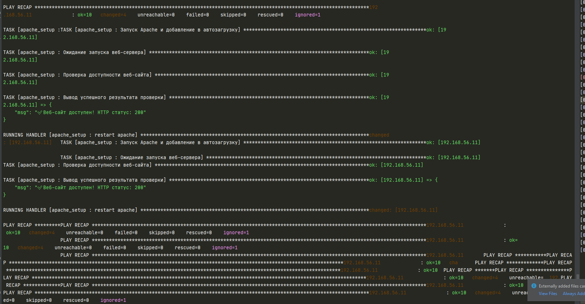
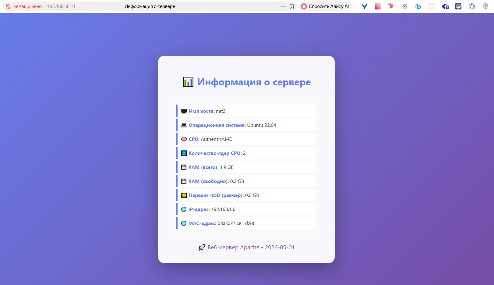

# Домашнее задание к занятию «Ansible.Часть 2» Ражев М.Н

## Задание 1

1. Скачать какой-либо архив, создать папку для распаковки и распаковать скаченный архив. Например, можете использовать официальный сайт и зеркало Apache Kafka. При этом можно скачать как исходный код, так и бинарные файлы, запакованные в архив — в нашем задании не принципиально.
2. Установить пакет tuned из стандартного репозитория вашей ОС. Запустить его, как демон — конфигурационный файл systemd появится автоматически при установке. Добавить tuned в автозагрузку.
3. Изменить приветствие системы (motd) при входе на любое другое. Пожалуйста, в этом задании используйте переменную для задания приветствия. Переменную можно задавать любым удобным способом.
   
 
**Ответ**
Плейбук  \files\playbook-1.yml
Плейбук  \files\playbook-2.yml
Плейбук  \files\playbook-3.yml

-----------------------------------------------------------------------------------

## Задание 2

Модифицируйте плейбук из пункта 3, задания 1. В качестве приветствия он должен установить IP-адрес и hostname управляемого хоста, пожелание хорошего дня системному администратору.   
  
**Ответ**
Плейбук  \files\playbook-4.yml

-----------------------------------------------------------------------------------

## Задание 3

Создайте плейбук, который будет включать в себя одну, созданную вами роль. Роль должна:

1. Установить веб-сервер Apache на управляемые хосты.
2. Сконфигурировать файл index.html c выводом характеристик каждого компьютера как веб-страницу по умолчанию для Apache. Необходимо включить CPU, RAM, величину первого HDD, IP-адрес. Используйте Ansible facts и jinja2-template. Необходимо реализовать handler: перезапуск Apache только в случае изменения файла конфигурации Apache.
3. Открыть порт 80, если необходимо, запустить сервер и добавить его в автозагрузку.
4. Сделать проверку доступности веб-сайта (ответ 200, модуль uri).

В качестве решения:
 - предоставьте плейбук, использующий роль;
 - разместите архив созданной роли у себя на Google диске и приложите ссылку на роль в своём решении;
 - предоставьте скриншоты выполнения плейбука;
 - предоставьте скриншот браузера, отображающего сконфигурированный index.html в качестве сайта.
 
 **Ответ**
 Плейбук, использующий роль \files\role_play.yml
 Созданная роль  \files\roles\apache_setup
 
Скриншот выполнения плейбука
 

Скриншот браузера
 
