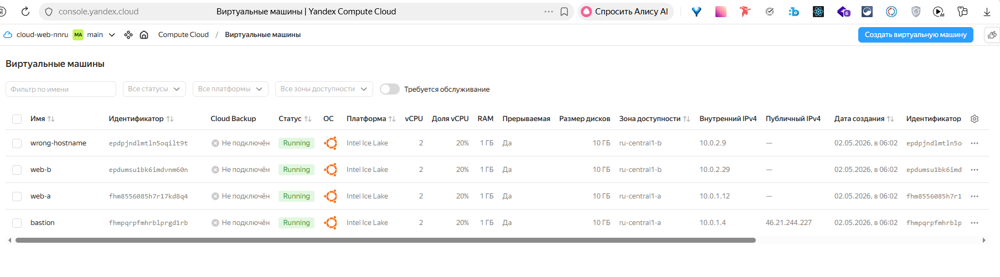
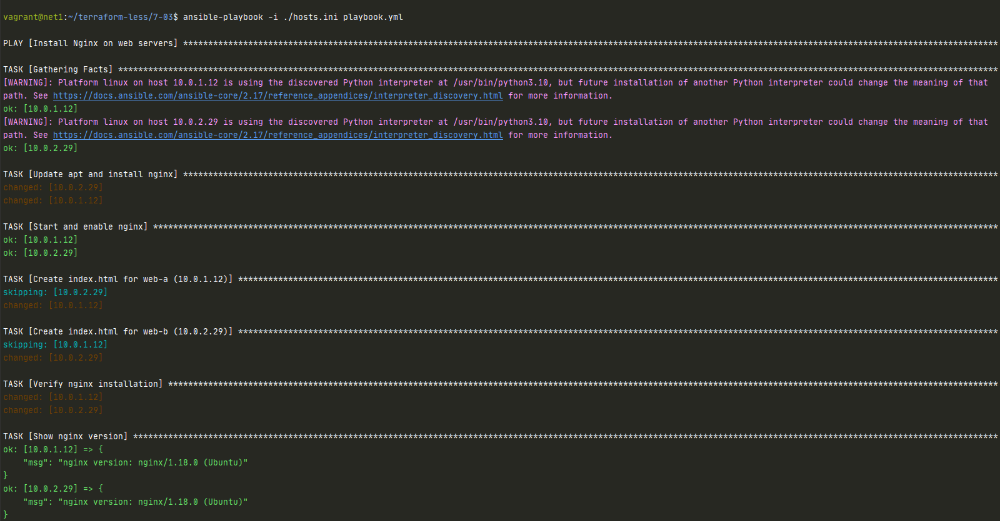

# Домашнее задание к занятию «Ansible.Часть 2» Ражев М.Н

## Задание 1

Повторить демонстрацию лекции(развернуть vpc, 2 веб сервера, бастион сервер)   
 
**Ответ**
Скрин  

-----------------------------------------------------------------------------------

## Задание 2

С помощью ansible подключиться к web-a и web-b , установить на них nginx.(написать нужный ansible playbook)
Провести тестирование и приложить скриншоты развернутых в облаке ВМ, успешно отработавшего ansible playbook.  

**Ответ**
Скрин

Плейбук  \files\playbook.yml

