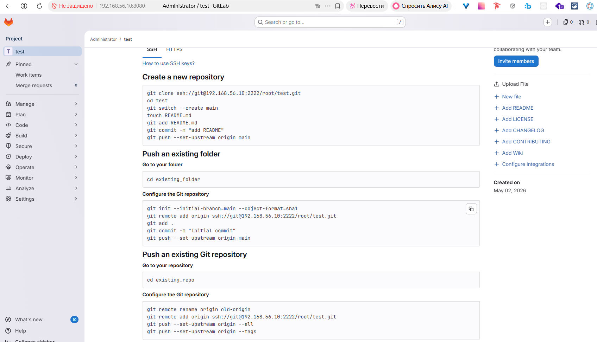
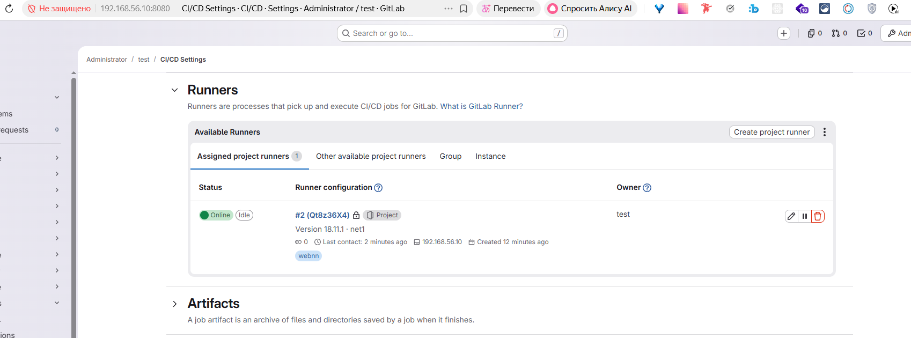
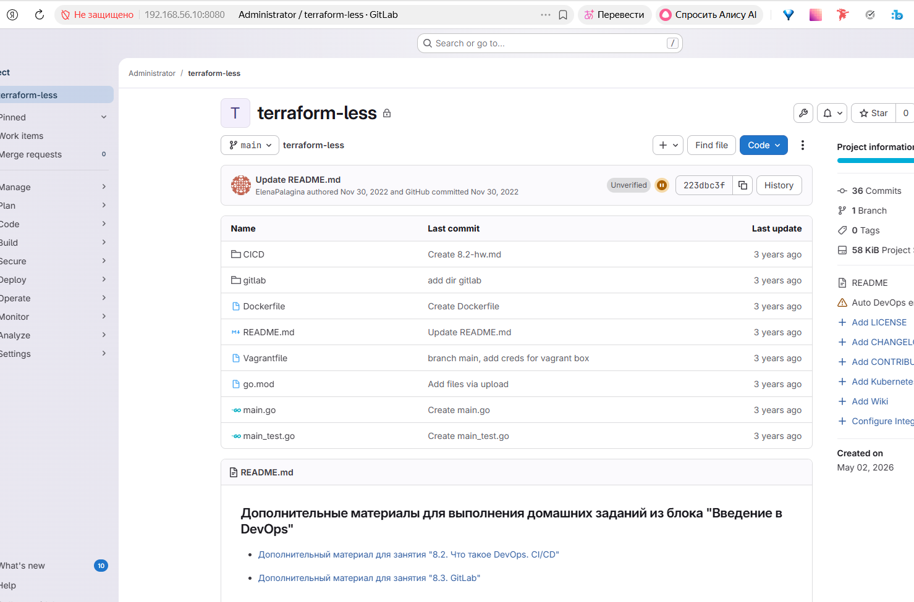

# Домашнее задание к занятию «GitLab» Ражев М.Н

## Задание 1

1. Разверните GitLab локально, используя Vagrantfile и инструкцию, описанные в этом репозитории.
2. Создайте новый проект и пустой репозиторий в нём.
3. Зарегистрируйте gitlab-runner для этого проекта и запустите его в режиме Docker. Раннер можно регистрировать и запускать на той же виртуальной машине, на которой запущен GitLab.
В качестве ответа в репозиторий шаблона с решением добавьте скриншоты с настройками раннера в проекте.
 
**Ответ**

Скриншот новый проект и пустой репозиторий в нём

Cкриншоты с настройками раннера в проекте

-----------------------------------------------------------------------------------

## Задание 2

1. Запушьте репозиторий на GitLab, изменив origin. Это изучалось на занятии по Git.
2. Создайте .gitlab-ci.yml, описав в нём все необходимые, на ваш взгляд, этапы.
  
**Ответ**

Скриншот 1: репозиторий на GitLab

 

2. Файлик files\.gitlab-ci.yml

-----------------------------------------------------------------------------------
